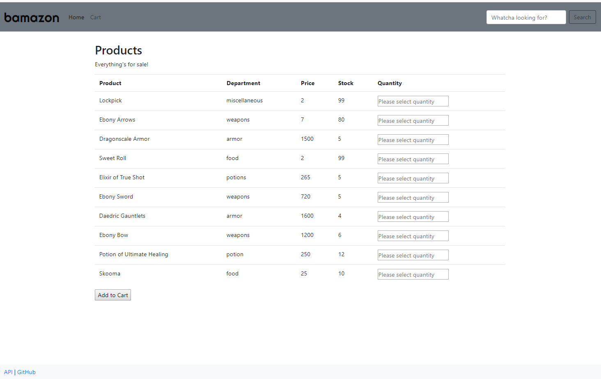

# Bamazon



### Overview

Modeled similarly to an Amazon-like storefront, this application displays product items rendered from a database and allows a user to indicate a quantity and add to their own shopping cart. 

Once the customer has placed their order, the application will check if the store has enough of the product to meet the customer's request. If not, the customer will see an error message and the order will not be fulfilled. 

If the store _does_ have sufficient quantity, the order will be fulfilled and the SQL database will reflect the new quantity after the purchase.

### Technologies Used

- HTML
- CSS
- JavaScript/jQuery
- Bootstrap
- MySQL
- Sequelize

### Model schema

```
product_name: DataTypes.STRING,
department_name: DataTypes.STRING,
price: DataTypes.DECIMAL,
stock_quantity: DataTypes.INTEGER
```

### Links

- [Github](https://fyeh0.github.io/Bamazon/)
- [Heroku](https://glacial-spire-39643.herokuapp.com/)